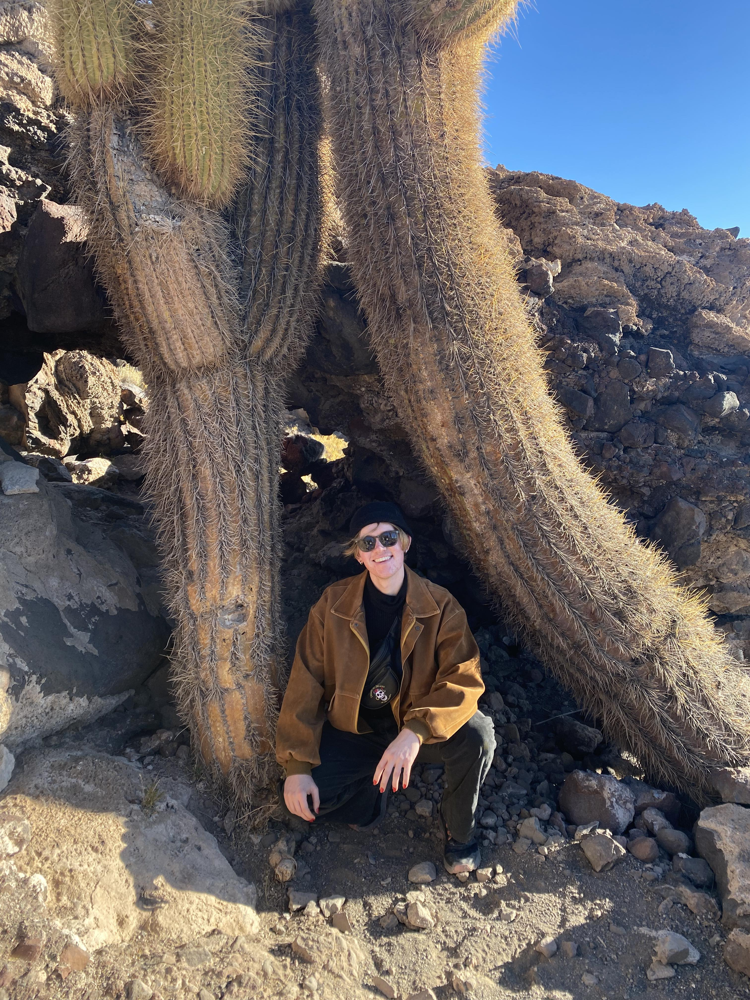

## This is Andy's passable website

This is a [link](https://github.com/a-jt84) to Andy's GitHub page. Andy's publically available GitHub repositories are all related to P8105: Data Science, a class at Columbia Mailman School of Public Health where Andy is currently learning R. Andy's GitHub is also linked in the drop-down menu in the top-right menu in this webpage!

* Here's a link to the [about](about.html) page.
* Here's a link to the [resume](resume.html) page.

## Bragging about summer 

For their summer APEx, Andy eschewed real work and instead went to Chile to "do epidemiology research" and to see some pretty sites. Below are some photos of their exploits. 

Photo 1: Pic of me and my friend Gabi at Machu Peach

Photo 2: Pic of me in front of the Scorpio constellation in the Atacama desert 

Photo 3: Pic of me in front of a neat cactus in Uyuni, Bolivia
